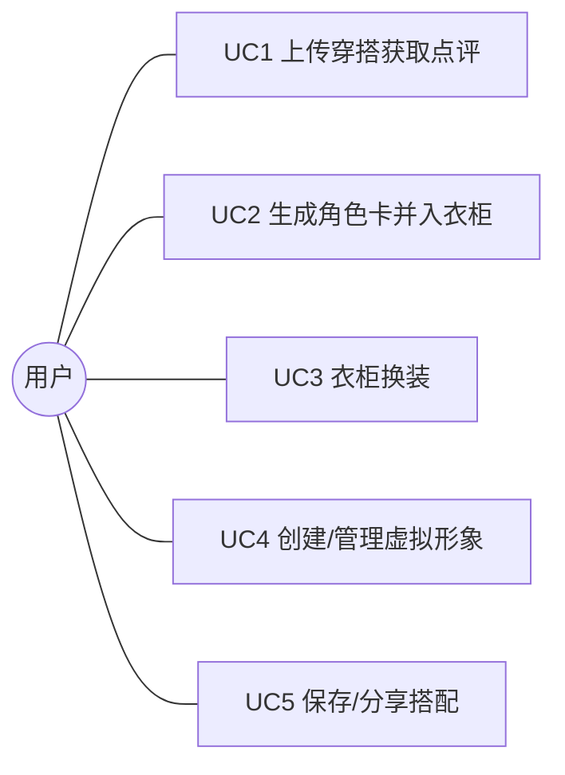
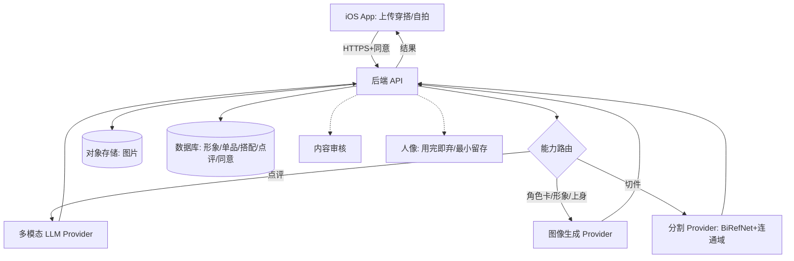

# 需求分析（Requirements Analysis）

> 产品（暂定名）：**穿搭分身 / StyleTwin**　·　配套文档：`SRS.md`
> 版本：v0.1（草案）　·　日期：2026-06-20
> 更新：2026-06-24　增补 §13 候选增强 Backlog（tab/toggle、Live2D、Claude 设计探索）

本文件在 `SRS.md` 的需求基线之上，做利益相关者、用例、流程、优先级、可行性、关键决策、风险与追踪分析，用于评估"该不该做、先做什么、风险在哪"。

---

## 1. 分析目标
- 确认 MVP 范围与优先级是否自洽、可落地。
- 暴露并量化关键风险（隐私、成本、生成质量、第三方依赖）。
- 沉淀关键架构决策及其理由，避免后续返工。

---

## 2. 利益相关者
| 干系人 | 关注点 |
|--------|--------|
| 终端用户 | 出片好看、点评有用、换装好玩、隐私可控 |
| 产品/研发 | 范围可控、技术可行、迭代节奏 |
| AI 服务商 | 合规调用、用量与计费、内容政策 |
| 应用商店 / 监管 | 隐私合规、人像与未成年人保护、内容安全 |
| 出资方 | 成本结构与商业化路径 |

---

## 3. 用户画像（Personas）
- **P1 出片型「小美」**：爱在社交平台分享，被"生成你的角色卡"吸引而来；核心价值 = 角色卡好看、易分享。
- **P2 整理型「阿哲」**：衣服多、纠结搭配；核心价值 = 攒衣柜 + 点评 + 换装找灵感。
- **P3 娱乐型「丸子」**：喜欢捏人/换装小游戏；核心价值 = 虚拟分身换装的趣味与收集。

---

## 4. 核心用例

### 4.1 用例总览

### 4.2 主用例事件流（节选）

**UC2 生成角色卡并入衣柜**（对应 FR-3、FR-4、FR-5）
- 前置：已上传一张穿搭图，并已取得隐私同意。
- 主成功场景：
  1. 用户在点评结果页点击"生成我的穿搭卡"。
  2. 系统提交【穿搭图 + 形象设定】给图像生成 Provider，展示进度态。
  3. 返回角色卡（虚拟形象 + 白底平铺服装拆解）。
  4. 系统对平铺区做"背景去除 + 连通域"切件，得到若干透明单品。
  5. 系统为单品自动打类别标签，写入衣柜。
  6. 用户确认/修边/重命名后保存。
- 扩展/异常：
  - 2a 生成失败 → 重试或降级（仅返回点评，不阻塞）。
  - 4a 单品粘连/漏切 → 进入手动修边。
  - 5a 标签判错 → 用户手动改类别。

**UC3 衣柜换装**（对应 FR-7、FR-8）
- 主成功场景：选形象 → 从衣柜拖单品到形象锚点 → 同部位替换、图层叠放 → 保存搭配。
- 扩展：点"上身看看"→ 触发上身重生成（FR-8）；失败回退图层效果。

---

## 5. 业务流程与数据流

**要点**：人像照片在"上传 → 生成/切件"链路中离开设备进入云端（约束 C-2）；故 `P 人像最小留存` 与 `M 内容审核` 是横切关注点，非可选项。

---

## 6. 功能优先级（MoSCoW）
| 优先级 | 需求 |
|--------|------|
| **Must** | FR-1 上传、FR-2 点评、FR-3 角色卡、FR-4 切件、FR-5 衣柜、FR-6(b) 预设形象、FR-7 2D 换装、FR-11 隐私同意/删除 |
| **Should** | FR-6(a) 自拍身份保持形象、FR-8 上身重生成、FR-9 保存搭配、FR-10 账户 |
| **Could** | 分享导出、搭配收藏夹、点评偏好设置 |
| **Won't（本期）** | AR 全身试穿、3D 形象/换装、真实体型精确试穿(B)、电商、社区、**Live2D 绑定换装（待评估）** |

---

## 7. 可行性分析

### 7.1 技术可行性
沿用前期讨论的难度分级，**MVP 路线刻意把难点工程绕开**：
| 模块 | 难度 | 风险消解策略 |
|------|------|--------------|
| 上传 + 图文点评 | ⭐⭐ | 成熟多模态 API |
| 角色卡生成 | ⭐⭐⭐ | 直接调图像生成；"生成"而非"硬解析穿身照" |
| 切件 | ⭐⭐⭐→⭐⭐ | 在**白底平铺图**上切，难分割退化为易分割 |
| 2D 换装 | ⭐⭐ | 纸娃娃；几何对齐甩给"上身重生成" |
| 形象生成 | ⭐⭐⭐ | 身份保持生成；MVP 可先用预设形象兜底 |
> 关键判断：**A 方向 + 生成→分割 + 2D+重生成** 三个决策，使本产品 **无需自研重型 ML、无需 3D 管线**，技术风险可控。

### 7.2 成本可行性
- 主成本 = **按次 AI 调用**（图像生成 > 点评 > 切件）。
- 控制：结果缓存、单用户配额、低优任务降级、对热门预设形象预生成、后续可自托管分割/生成降本。

### 7.3 合规可行性
- 最大变量是 **人像数据**：可控，但需投入（同意流、最小留存、Provider 条款、审核、删除权）。**强烈建议尽早明确目标上架地区**，因为它直接决定合规强度。

### 7.4 进度可行性
- M0（点评最短链路）可快速验证需求；M1 形成核心玩法闭环；M2/M3 增强与合规。分期清晰，里程碑独立可交付。

---

## 8. 关键设计决策（ADR 摘要）
| 编号 | 决策 | 理由 | 代价/取舍 |
|------|------|------|-----------|
| D1 | 选 **A 风格化形象** | 绕开"虚拟形象 vs 真实体型不符" | 不还原本人身材（A 方向可接受） |
| D2 | 拆解 = **生成→分割** 两段式 | 把"穿身照硬抠"的遮挡难题，变成白底平铺图上的易分割；并自动补全被遮挡部分 | 单品是"重画的相似件"，非真品复刻 |
| D3 | 换装 = **2D 纸娃娃 + 上身重生成** | 躲开 3D 建模/UV/渲染/布料模拟 | 上身效果依赖一次生成调用（延迟+成本） |
| D4 | 形象 = **身份保持生成 / 预设** | 保脸神似、不保身材；可快速给到 MVP | 身份可能跨次漂移 → 生成一次后固定复用 |
| D5 | **云端生成 + 减害** | 端上无同级算力，生成不可避免上云 | 人像上云的隐私负担 → 用最小留存/合规缓解 |
| D6 | **AI 能力 Provider 抽象** | 模型可替换/自托管，避免锁定与涨价风险 | 多一层接口设计成本 |
| D7 | 换装表现本期定 **2D 纸娃娃**，Live2D 列为候选 | 纸娃娃避开逐角色绑定/授权/切件适配；Live2D 更生动但成本高 | 本期牺牲“动态生动感”，留待 M1 后评估 |

---

## 9. 风险登记册
| ID | 风险 | 影响 | 概率 | 缓解 |
|----|------|------|------|------|
| R1 | 人像隐私/合规不达标 | 高（下架/法律） | 中 | 同意流、最小留存、合规 Provider、删除权、明确地区 |
| R2 | 生成保真度漂移/质量不稳 | 中 | 高 | 设质量抽检指标、参考图条件化、可重试、人工修边兜底 |
| R3 | AI 调用成本失控 | 高 | 中 | 计量归因、配额、缓存、降级、后续自托管 |
| R4 | 第三方接口依赖（可用性/政策/涨价） | 高 | 中 | Provider 抽象 + 多供应商 + 自托管预案 |
| R5 | 生成延迟伤体验 | 中 | 高 | 流式/进度态、异步与预生成、合理预期管理 |
| R6 | 用户上传/生成不当内容 | 高 | 中 | 上传与产出双向内容审核、遵守 Provider 政策、未成年人保护 |
| R7 | 形象一致性漂移 | 中 | 中 | 形象生成一次后固定存储复用、身份保持技术（InstantID 等） |
| R8 | 若引入 Live2D：逐角色绑定成本、Cubism 商用授权、切件不适配骨架 | 中 | 中 | 维持纸娃娃；仅在 M1 验证后专项评估；先用 idle 动效低成本提升生动感 |

---

## 10. 需求追踪矩阵（节选）
| 需求 | 对应用例 | 优先级 | 关联风险 |
|------|----------|--------|----------|
| FR-1 上传 | UC1/UC2 | Must | R1 |
| FR-2 点评 | UC1 | Must | R4,R5 |
| FR-3 角色卡 | UC2 | Must | R2,R3,R5,R6 |
| FR-4 切件 | UC2 | Must | R2 |
| FR-5 衣柜 | UC2/UC3 | Must | — |
| FR-6 形象 | UC4 | Must/Should | R7,R1 |
| FR-7 2D 换装 | UC3 | Must | — |
| FR-8 上身重生成 | UC3 | Should | R2,R3,R5 |
| FR-11 隐私 | 全局 | Must | R1,R6 |

---

## 11. MVP 范围与里程碑
| 里程碑 | 内容 | 目标 |
|--------|------|------|
| **M0** | FR-1、FR-2 | 验证"上传即得有用点评"的需求 |
| **M1** | FR-3、FR-4、FR-5、FR-6(b)、FR-7 | 跑通"生成卡→切件→衣柜→2D 换装"核心闭环 |
| **M2** | FR-8、FR-9、FR-6(a) | 提升出片质量与分享传播 |
| **M3** | FR-10、FR-11 全量、NFR-3/4 强化 | 账户与合规收口 |

---

## 12. 待确认的开放问题（Open Questions）
1. **目标上架地区**？（直接决定隐私合规强度——建议优先确定）
2. 产品正式名称与品牌。
3. 商业模式（订阅 / 生成次数计费 / 免费+增值）？影响成本与配额设计。
4. 虚拟形象是否 **必须本人神似**，还是"风格化即可"？决定是否要做 FR-6(a)。
5. 是否要求登录才能使用？影响 M0 体验门槛。
6. 内容审核的尺度与策略（自建 / 用 Provider 审核 / 人工复核）。
7. 「点评 / 衣柜」小屏布局采用 **tab / toggle / 分屏** 哪种？（设计阶段定；需兼顾“边看点评边整理衣柜”场景）
8. 是否引入 **Live2D 动态换装**？若做，何时（建议 M1 核心闭环验证后再评估）。
9. 何时用 **Claude 做 UI 设计探索**？（建议进入“设计对话”后，以 SRS / 本分析为输入）

> 以上问题不阻塞 M0/M1 启动；建议在进入 M2 前给出结论。

---

## 13. 候选增强与创意 Backlog（待评估，不进本期）

> 干系人脑暴的入口。每条经“分诊”：价值 × 可行性/成本 × 风险 → 处置。**记录但不立即实现。**

| 想法 | 类别 | 价值 | 可行性 / 成本 | 风险 | 处置 |
|------|------|------|---------------|------|------|
| 「对话 + 衣柜」tab/toggle 全屏切换 | 交互设计（易用性） | 小屏下各自展示更完整 | 高 / 极低（iOS 原生标准控件） | tab 硬切 → 无法同屏对照点评与衣柜 | **设计阶段**定方案；需求侧记“便捷切换 + 各自全屏” |
| Live2D 小人承载切件、动态换装 | 形态 / 玩法（重大扩张） | 二次元调性强、更生动、利留存（P3） | 低 / 高（逐角色绑定、Cubism 商用授权、切件随骨架形变未成熟） | 撞决策 D3 初衷；成本 / 法务（见 R8） | **Won't（本期）**；列 Roadmap，M1 核心闭环验证后再评估；先用 idle 动效（呼吸/眨眼）低成本提升生动感 |
| 用 Claude 做 UI 设计探索 / 写提示词 | 流程 / 工具（属设计阶段） | 加速界面设计 | 高 / 低 | 越出“需求阶段”边界 | 推迟到**设计对话**，以 SRS / 本分析为输入 |
